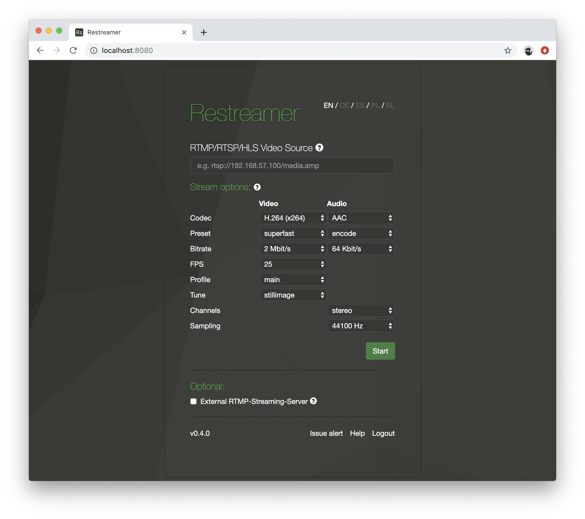
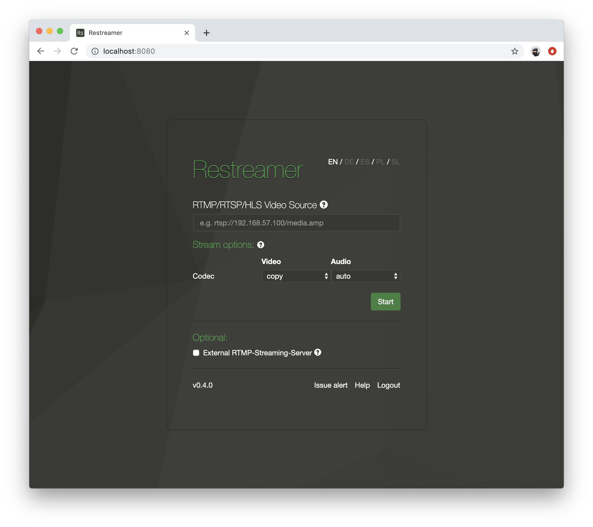

As of Restreamer version 0.4.0 you can choose to encode the video stream that you are pulling from the camera to [H.264](../wiki/h264.html). 
Encoding of the video streams enables you to use stream sources that are not encoded in H.264 or to re-encode a video stream that is
already encoded in H.264, but you want to change e.g. the bitrate.

The encoding is always towards H.264 as this is the most compatible codec for HLS streaming and the only useful choice for pushing
the stream to a RTMP server, e.g. Youtube, Twitch, ...

## Default Settings

By default, the settings for the video codec is `copy` and for the audio codec `auto`. These are also the default
settings for the Restreamer versions before 0.4.0.

If you set the `RS_AUDIO` environment variable on the command line, its value will be translated to the following settings:

Value | Codec | Preset | Bitrate | Channels | Sampling
------|-------|--------|---------|----------|---------
`auto` | `auto` | - | - | - | -
`none` | `none` | - | - | - | -
`silence` | `aac` | `silence` | `64 Kbit/s` | `mono` | `44100`
`aac` | `aac` | `encode` | `64 Kbit/s` | `inherit` | `inherit`
`mp3` | `mp3` | `encode` | `64 Kbit/s` | `inherit` | `inherit`

## Video Setting

The default video codec setting is `copy`. This means that the video stream from the source is used unmodified for the player and for
optionally pushing it to an external RTMP server.

### Codec

Choose `H264` as video codec to enforce an encoding of the video stream from the source. This will reveal more encoding options.

Encoding the video stream may require significant CPU resources.
{: .notice--warning}

### Preset

The presets are predefined sets of encoding parameter. They will enable/disable specific encoding alogrithms that affect the resulting
image quality and the encoding speed (i.e. CPU usage). The available presets are `ultrafast`, `superfast`, `veryfast`, `faster`, `fast`,
`medium`, `slow`, `slower`, `veryslow`, and `placebo`, whereas `ultrafast` uses the least CPU resources but produces the lowest
image quality. On the other end of the spectrum is `placebo` which uses a lot of CPU resources but produces the highest image quality.

### Bitrate

The bitrate sets the amount of data that the encoder is allowed to output per a second of video. A low bitrate will result in a low
video image quality and a high bitrate will result in better video image quality. It defines also the bandwidth that is required
in order to watch the video stream or to push the video stream to an external RTMP server.

You can find different suggestions for optimal bitrates over at [Google](https://support.google.com/youtube/answer/2853702?hl=en) or
[Twitch](https://stream.twitch.tv/encoding/).

### FPS

The frames per second (or FPS) is defining how many individual images are stored in a second of video. Usually a frame rate of 25 or
30 per second is enough. It is possible to go up to 60 frames per seconds.

### Profile

The profile defines what a decoder needs to be capable of in order to decode the video stream that you are encoding. By setting this
to `auto`, the encoder makes this decision for you based on the width, height, and FPS of the video stream to be encoded. This is usually
a good choice. You can override these automatic settings with the values `baseline`, `main`, or `high`. The higher the profile, the more
advanced the decoder needs to be and more specific algorithms can be used to encode the video stream. You should only change this setting
if you know what you are doing. `baseline` gives you the most compatibility and `high` the least.

If you choose `ultrafast` as preset, the profile will always be `baseline`.

### Tune

The tune parameter allows you to optimize the encoding of certain content in the source stream.

Tune | Description
-----|------------
none | Don't apply any tuning 
film | Use for high quality movie content; lowers deblocking
animation | Good for cartoons; uses higher deblocking and more reference frames
grain | Preserves the grain structure in old, grainy film material
stillimage | Good for slideshow-like content
fastdecode | Allows faster decoding by disabling certain filters
zerolatency | Good for fast encoding and low-latency streaming

Read more on this topic in the ffmpeg [H.264 Video Encoding Guide](https://trac.ffmpeg.org/wiki/Encode/H.264).

## Audio Settings

The default video codec setting is `auto`. This means that the audio stream from the source is used unmodified for the player and for
optionally pushing it to an external RTMP server. If the audio is not in a compatible format, it will be encoded to AAC.

### Codec

Choose `copy` in order to copy the audio stream unmodified from the source. `none` will remove the audio stream if the source has an
audio stream. `AAC` and `MP3` will re-encode the audio stream to AAC, resp. MP3.

### Preset

Here you can decide if you actually want to re-encode the existing audio stream (choose `encode`), or to replace the audio with silence
(choose `silence`). In case the source doesn't contain an audio stream, an audio stream will be added.

### Bitrate

The bitrate sets how many bits should one second of audio use up. A low bitrate will result in lower audio quality and a higher bitrate
will result in better audio quality. If you set the bitrate higher than what you already get from the source, then you will usually not
gain any quality.

If you choose `silence` a the preset, then you can go with the lowest bitrate.

### Channels

Choose either `mono` or `stereo` for the channel layout. In case you don't want to change the channel layout from an existing audio
stream, select `inherit`.

### Sampling

Select an appropriate sampling rate for the audio stream. In case you don't want to change sampling rate from an existing audio stream,
select `inherit`.
