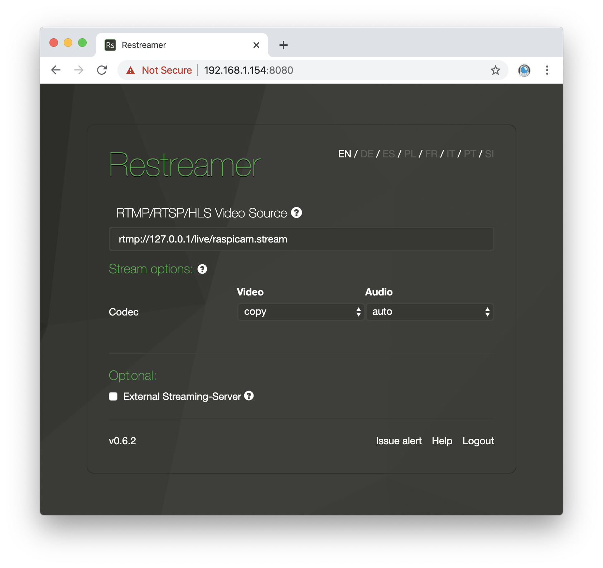

The Raspicam is the [video module for the Raspberry Pi](https://www.raspberrypi.org/products/camera-module-v2/) devices.
We recommend that you use the latest [Raspbian](https://www.raspberrypi.org/downloads/raspbian/) distribution
that has the video capture tools in `/opt/vc` pre-installed.

## Enable RaspiCam

Execute the `raspi-config` command and then select `Enable Camera`. Leave `raspi-config` and reboot your Raspberry Pi.

## Configure Restreamer

For Restreamer to be able to access the RaspiCam, you have to stop the Restreamer if it is currently running:

```sh
docker stop restreamer
docker rm restreamer
```

Restart the Restreamer with the environment variable `RS_MODE` set to `RASPICAM` and mounting the directory with the Raspberry Pi video capture
tools into the container (`/opt/vc`). Also you have to raise the privileges for the docker container in order to access the camera.

```sh 
docker run -d --restart always \
    --name restreamer \
    -e "RS_USERNAME=..." -e "RS_PASSWORD=..." -e "RS_MODE=RASPICAM" \
    -p 8080:8080 \
    -v /mnt/restreamer/db:/restreamer/db \
    -v /opt/vc:/opt/vc \
    --privileged \
    datarhei/restreamer-armv7l:latest
```

In order to stream what your RaspiCam is recording, you have to put `rtmp://127.0.0.1/live/raspicam.stream` into
the "RTMP/RTSP/HLS Video Source" field and press "Start".



## Environment Variables

These environment variables enable you to control the Raspberry Pi camera.

| Name | Default | Description |
|------|---------|-------------|
| `RS_RASPICAM_HFLIP` | `false` | Set to `true` to flip the video horizontally. |
| `RS_RASPICAM_VFLIP` | `false` | Set to `true` to flip the video vertically. |
| `RS_RASPICAM_INLINE` | `true` | Set to `true` to insert inline SPS and PPS headers on every I-Frame. This is recommended for HLS streaming. |
| `RS_RASPICAM_STABILIZATION` | `false` | Set to `true` to enable video stabilization. |
| `RS_RASPICAM_FPS` | `25` | Set the framerate. Possible values are between `2` and `30`. |
| `RS_RASPICAM_GOP` | `50` | Set the GOP size. Usually the framerate multiplied by 2 is a good value. |
| `RS_RASPICAM_BITRATE` | `5000000` | Bitrate of the video stream in bit/s. E.g. `5000000` is 5Mbit/s. For a high quality H264 stream with 1920x1080@30 a bitrate of 15Mbit/s would be suffucient. The maximum is `25000000` (25Mbit/s) |
| `RS_RASPICAM_H264PROFILE` | `high` | H264 profile. Possible values are `baseline`, `main`, or `high`. |
| `RS_RASPICAM_H264LEVEL` | `4` | H264 level. Possible values are `4`, `4.1`, or `4.2`. |
| `RS_RASPICAM_CODEC` | `H264` | Video codec. Possible values are `H264` or `MJPEG`. We do not recommend to change this value. |
| `RS_RASPICAM_WIDTH` | `1920` | Video stream width in pixels. Possible values are between `64` and `1920`. |
| `RS_RASPICAM_HEIGHT` | `1080` | Video stream height in pixels. Possible values are between `64` and `1080`. |
| `RS_RASPICAM_SHARPNESS` | `0` | Sharpeness of the video. Possible values are between `-100` and `100`. |
| `RS_RASPICAM_CONTRAST` | `0` | Contrast of the video. Possible values are between `-100` and `100`. |
| `RS_RASPICAM_BRIGHTNESS` | `50` | Brightness of the video. Possible values are between `0` and `100`. |
| `RS_RASPICAM_SATURATION` | `0` | Saturation of the video. Possible values are between `-100` and `100`. |
| `RS_RASPICAM_QP` | `0` | Set quantisation parameter. Possible values are between `10` and `40`. This affects the image quality. Higher values reduce the quality. Set to `0` to turn off. |
| `RS_RASPICAM_ISO` | `0` | Set the ISO level. Possible values are between `100` and `800`. `0` for automatic ISO. |
| `RS_RASPICAM_EV` | `0` | Set EV compensation, steps of 1/6 stop. Possible values are  between `-10` and `10`|
| `RS_RASPICAM_EXPOSURE` | `auto` | Set exposure mode. Possible values are: `off`, `auto`, `night`, `nightpreview`, `backlight`, `spotlight`, `sports`, `snow`, `beach`, `verylong`, `fixedfps`, `antishake`, or `fireworks` |
| `RS_RASPICAM_FLICKER` | `off` | Set flicker avoid mode. Possible values are: `off`, `auto`, `50hz`, or `60hz` |
| `RS_RASPICAM_AWB` | `auto` | Set AWB mode. Possible values are: `off`, `auto`, `sun`, `cloud`, `shade`, `tungsten`, `fluorescent`, `incandescent`, `flash`, or `horizon` |
| `RS_RASPICAM_IMXFX` | `none` | Set an image effect. Possible values are: `none`, `negative`, `solarise`, `sketch`, `denoise`, `emboss`, `oilpaint`, `hatch`, `gpen`, `pastel`, `watercolour`, `film`, `blur`, `saturation`, `colourswap`, `washedout`, `posterise`, `colourpoint`, `colourbalance`, or `cartoon` |
| `RS_RASPICAM_METERING` | `average` | Set a metering mode. Possible values are: `average`, `spot`, `backlit`, or `matrix` |
| `RS_RASPICAM_DRC` | `off` | Enable dynamic range compression. Possible values are: `off`, `low`, `med`, or `high` |

Change the defaults of these environment variable with care and make sure that you know what you are doing. Read more about the available camera
settings in the [Raspberry Pi camera documentation](https://www.raspberrypi.org/documentation/raspbian/applications/camera.md).

## raspi-config is missing

If you are running a Linux on your Raspberry Pi that is missing the `raspi-config` program, you have to install it first:

```sh
cd /tmp
sudo apt-get update && apt-get install -y alsa-utils
wget https://archive.raspberrypi.org/debian/pool/main/r/raspi-config/raspi-config_20180406+1_all.deb
sudo dpkg -i raspi-config_20180406+1_all.deb
```

Please check `https://archive.raspberrypi.org/debian/pool/main/r/raspi-config/` for the lastest available version of `raspi-config`.

[Source](https://github.com/snubbegbg/install_raspi-config)