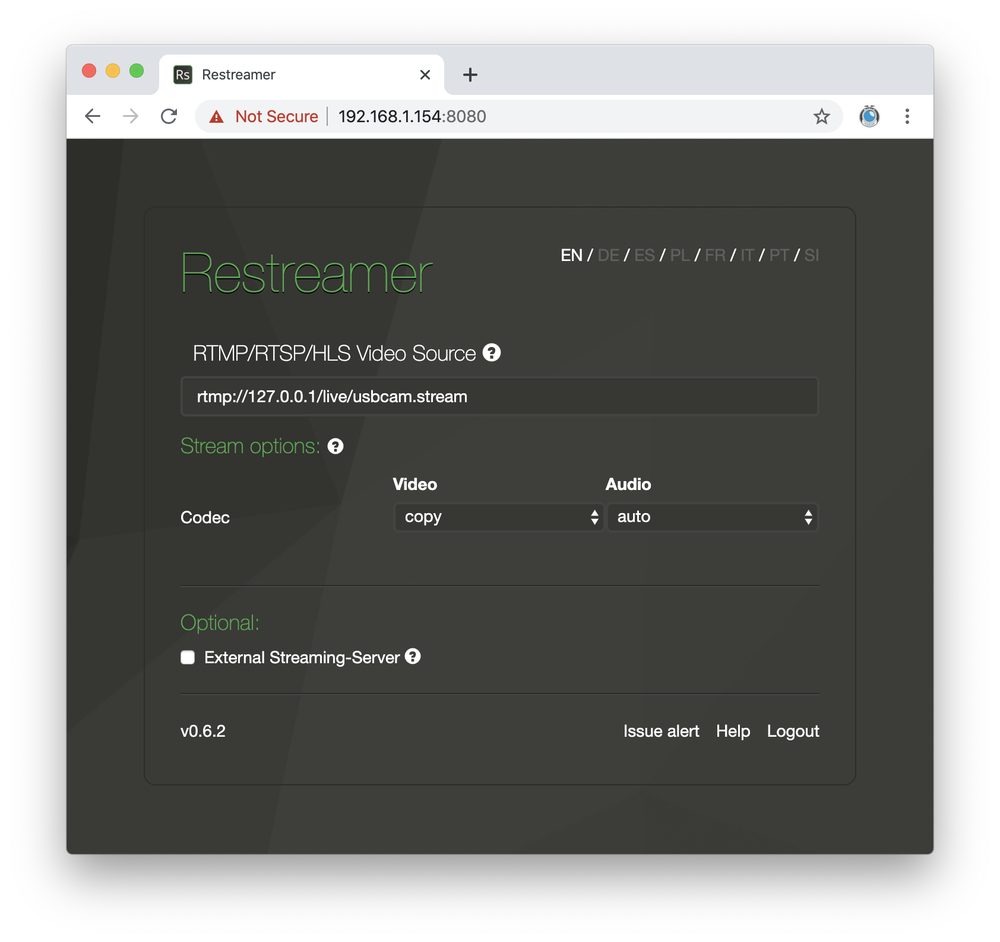

On ARMv6l / ARMv7l (e.g. Raspberry Pi), USB camera work but only with a very low framerate. It will work with a higher
framerate on more powerfull systems. Because the video stream from an USB camera is usually not encoded in H.264 (which is a
requirement for Restreamer), it needs to be encoded. This encoding requires significant CPU resources.

Your USB camera needs to be v4l compliant in order to work with Restreamer.
{: .notice--info}

## Configure Restreamer

Connect the USB camera. For Restreamer to be able to access the USB camera, you have to stop the Restreamer if it is currently running:

```sh
docker stop restreamer
docker rm restreamer
```

Restart the Restreamer with the USB camera mode enabled:

```sh 
docker run -d --restart always \
    --name restreamer \
    -e "RS_USERNAME=..." -e "RS_PASSWORD=..." -e "MODE=USBCAM" \
    -p 8080:8080 \
    -v /mnt/restreamer/db:/restreamer/db \
    --device /dev/video0 \
    datarhei/restreamer:latest
```

If you are running this on an ARM device, please use the `datarhei/restreamer-armhf:latest` Docker image.
{: .notice--info}

In order to stream what your USB-Camera is recording, you have to put `rtmp://127.0.0.1/live/usbcam.stream` into
the "RTMP/RTSP/HLS Video Source" field and press "Start".



The first Restreamer start will take a while because it has to install some packages for the USB driver.
{: .notice--info}

## Environment Variables

These environment variables enable you to control the encoding of the video stream from your USB camera.

| Name | Default | Description |
|------|---------|-------------|
| `RS_USBCAM_DEVICE` | `/dev/video0` | The video device that you also pass in the command line for Docker. |
| `RS_USBCAM_FPS` | `25` | Set the framerate. |
| `RS_USBCAM_GOP` | `50` | Set the GOP size. Usually the framerate multiplied by 2 is a good value. |
| `RS_USBCAM_BITRATE` | `5000000` | Bitrate of the video stream in bit/s. E.g. `5000000` is 5Mbit/s. |
| `RS_USBCAM_H264PRESET` | `ultrafast` | Set a preset for H.264 encoding. Read more about the [available H.264 presets](http://dev.beandog.org/x264_preset_reference.html) |
| `RS_USBCAM_WIDTH` | `1280` | Video stream width in pixels. |
| `RS_USBCAM_HEIGHT` | `720` | Video stream height in pixels. |

Change the defaults of these environment variable with care and make sure that you know what you are doing.
