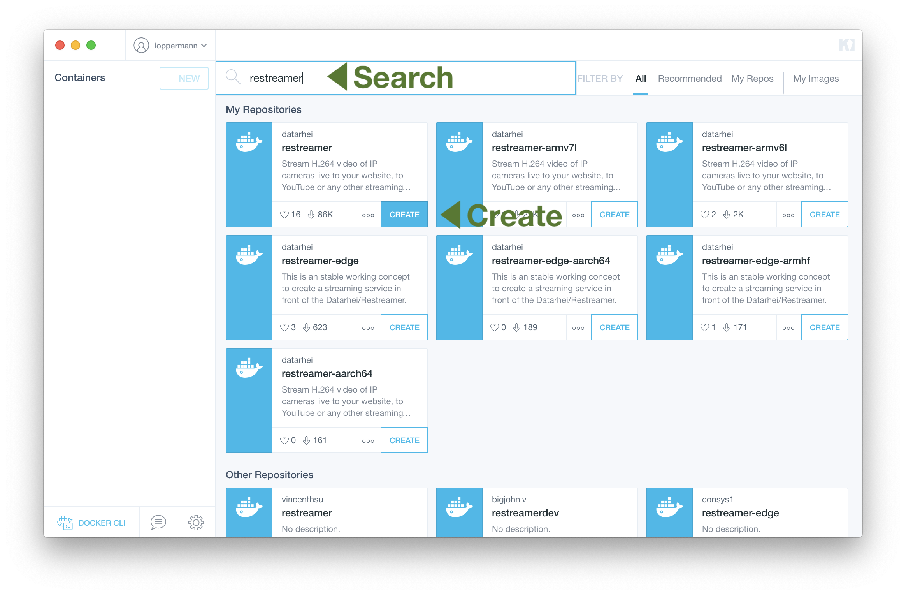
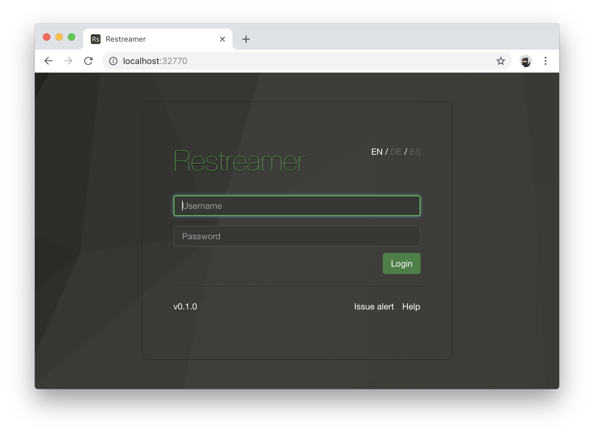
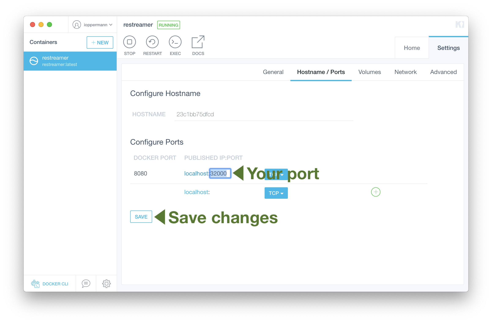

## Requirements

* 64bit Intel or AMD CPU
* macOS 10.13+ (High Sierra or later) or Windows 10 (Professional or Enterprise)

For other/older macOS or Windows versions, you can download the legacy [Docker Toolbox](https://docs.docker.com/toolbox/overview/).
Restreamer may run on it, but it is not officially supported.
{: .notice--info}

Docker is usually operated from the command line. If you're not comfortable with the command line (CLI), you can use one of the
available GUIs. Here, we recommend to use [Kitematic](https://github.com/docker/kitematic) which is also from Docker.

If you are fine with using the command line, you can follow the [installation (with CLI)](#installation-with-cli).

## Installation (with GUI)

1. Download, install, and run [Docker Desktop](https://www.docker.com/get-started). Follow the instructions for
[Windows](https://hub.docker.com/editions/community/docker-ce-desktop-windows) or [macOS](https://hub.docker.com/editions/community/docker-ce-desktop-mac).
2. Download and install [Kitematic](https://github.com/docker/kitematic/releases). 
3. Open Kitematic
   
4. Search for "restreamer" and select the "restreamer" image without "arm-"-tag:
   
5. Finally Kitematic is running the Restreamer container:
   
6. Open the Restreamer user interface by clicking on "WEB PREVIEW":
   
   
The default login is:

* Username: `admin`
* Password: `datarhei`

It is highly recommended to change the username and password.
{: .notice--warning}

### Important customizations

1. Click on the volume path and "Enable volumes". This allows Restreamer to store the current state in a place where it can be restored when you restart the container:
   
2. We highly recommend to change your password and username:
   

### Customization to embed the player on your website

If you want to embed the video player on your website, you have to forward the port of Restreamer generated by Kitematic from your router to your host system.

1. Select a custom port like 32000:
   
2. Open the Restreamer in your browser by entering `http://127.0.0.1:32000` in the URL bar

3. To setup the [port forwarding](../wiki/portforwarding.html) in your router, please check your router's the manual.

## Installation (with CLI)

1. Download, install, and run [Docker Desktop](https://www.docker.com/get-started). Follow the instructions for
[Windows](https://hub.docker.com/editions/community/docker-ce-desktop-windows) or [macOS](https://hub.docker.com/editions/community/docker-ce-desktop-mac).

2. Open a command-line terminal (`Terminal` for macOS, `PowerShell` for Windows) and start Restreamer

```sh
   $ docker run -d --restart always \
        --name restreamer \
        -e "RS_USERNAME=admin" -e "RS_PASSWORD=datarhei" \
        -p 8080:8080 -v ${HOME}/restreamer/db:/restreamer/db \
        datarhei/restreamer:latest
   ```

3. Browse to http://your-device-ip:8080

The default login is:

* Username: `admin`
* Password: `datarhei`

It is highly recommended to change the username and password.
{: .notice--warning}

### Important customizations

It is recommended to change the username and password. In order to change them you have to set the respective [environment variables](references-environment-vars.html)
in the docker command:

```sh
$ docker run ... -e "RS_USERNAME=YOUR_USERNAME" -e "RS_PASSWORD=YOUR_PASSWORD" ...
```

### Description of the command

#### `-d`

Detach the container. This means that the container will run in the background. You can run it interactively in the foreground with
`-it` instead of `-d`. To stop the Restreamer in detached mode, type `docker stop restreamer`. In interactive mode just hit `Ctrl-C` to
stop the Restreamer.

#### `--name restreamer`

Gives the container the name `restreamer`. This name can be used in other docker commands to control the container. In order to
stop the Restreamer, type `docker stop restreamer`. While the Restreamer is running you can log in into the container with `docker exec -it restreamer /bin/bash`.

#### `--restart always`

In case the Restreamer crashes, Docker will automatically restart the Restreamer.

#### `-e "RS_USERNAME=..." -e "RS_PASSWORD=..."`

Set values for the environment variables `RS_USERNAME` and `RS_PASSWORD`. See a description of all known [environment variables](references-environment-vars.html).

#### `-p 8080:8080`

Bind the port 8080 of the device to the port 8080 of the Restreamer. With this you can connect with your browser to the Restreamer GUI.
If you want to us another port, change it to e.g. `-p 31000:8080`.

#### `-v ${HOME}/restreamer/db:/restreamer/db`

The Restreamer stores the current state in the directory `/restreamer/db` inside the container. This command maps the directory `/mnt/restreamer/db`
of your device into the container. With this the state can be preserved in case the Restreamer needs to be restarted. If you want to store
the state in a different directory on your device, change it to e.g. `-v /tmp/restreamer:/restreamer/db`

#### `datarhei/restreamer:latest`

This is the docker image of the lastest Restreamer on the Docker Hub. Docker will check if the image is locally available
and download it if it is not available or a newer image is available.

