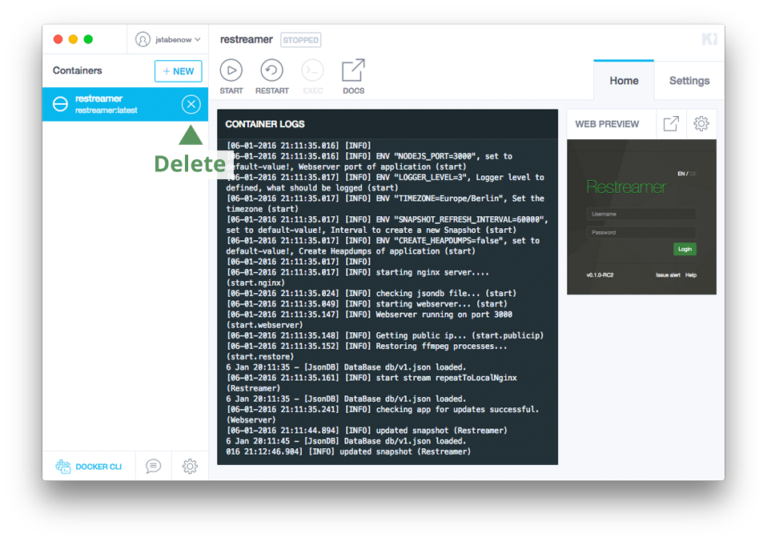
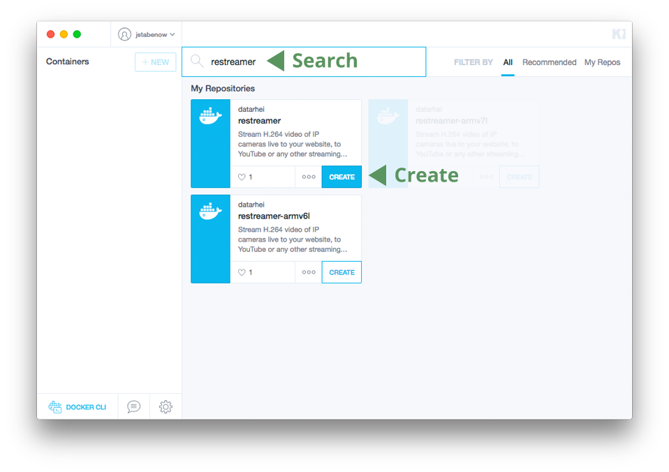
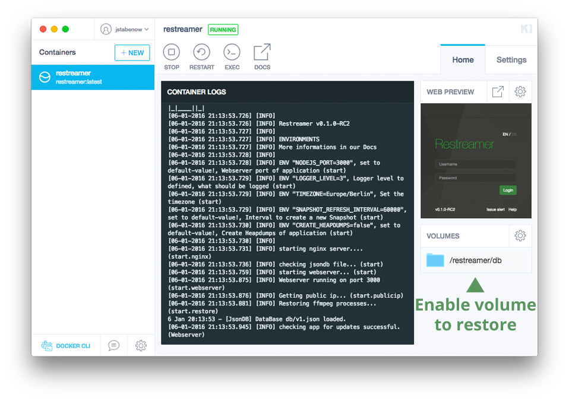

To update the Restreamer without loosing the data of the input fields it is required to start the Docker-Image with `-v /path/to/local:/restreamer/db` ([details](installation-linux-64.html#description-of-the-command)) or a activated volume in Kitematic (Docker Toolbox) ([details](installation-osx-windows.html#important-customizations))!

* [OSX / Windows](#osx-windows)
* [Linux](#linux)


## OSX / Windows

1. Open Kitematic and click in the running Restreamer on stop:

2. Delete the old image:

3. Start the image again: 

4. Enable the volume again:

5. Insert your enviroments again ([more here](installation-osx-windows.html#important-customizations))

Done! 

## Linux

1.
  Stop and remove the running Restreamer:   
  ```sh
  docker stop restreamer && docker rm restreamer
  ```
2.
  Download the new image. Please do not forget to add the right arm-tag if used:
  ```sh
  # for amd64 CPUs
  docker pull datarhei/restreamer:latest  

  # for arm32 CPUs with FPU support, e.g. Raspberry Pi, Odroid, ...
  docker pull datarhei/restreamer-armv7l:latest

  # for arm64 CPUs
  docker pull datarhei/restreamer-aarch64:latest

  # legacy (will not be updated)
  docker pull datarhei/restreamer-armv6l:latest
  ```
3.
  Start the Restreamer again (please remember to modify if you have your own configuration):   
  ```sh
  docker run -d --restart always \
    --name restreamer \
    -e "RS_USERNAME=YOUR-USERNAME" -e "RS_PASSWORD=YOUR-PASSWORD" \
    -p 8080:8080 \
    -v /mnt/restreamer/db:/restreamer/db \
    datarhei/restreamer:latest
  ```

Done!
